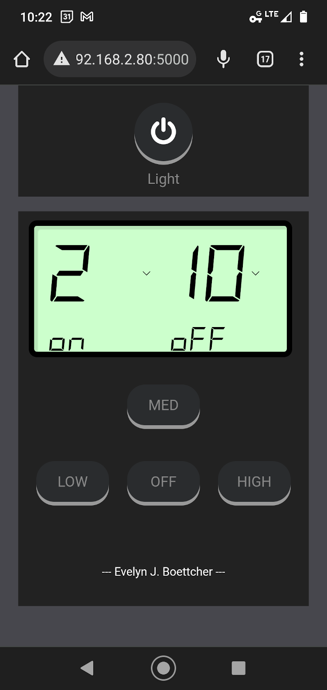
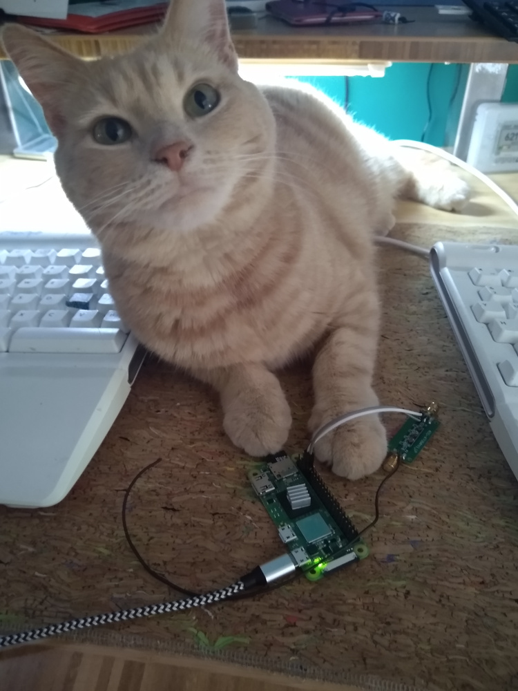
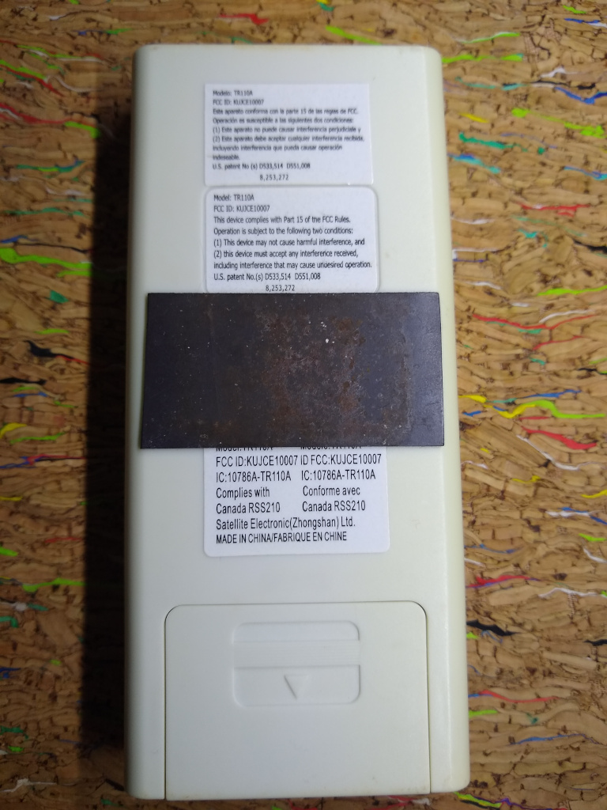
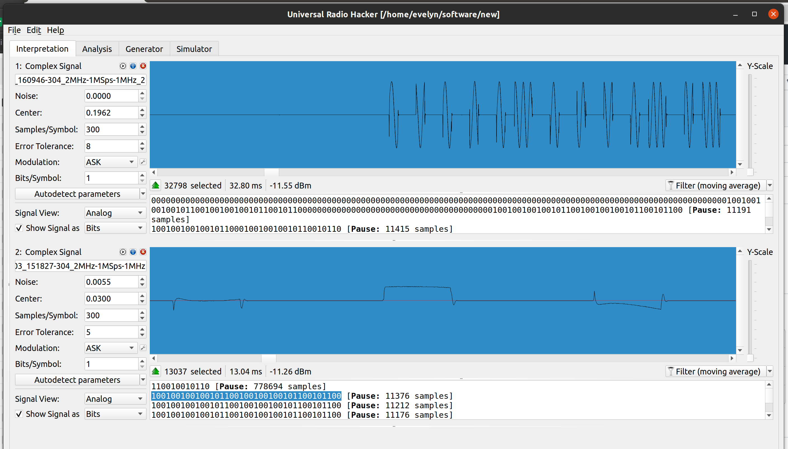
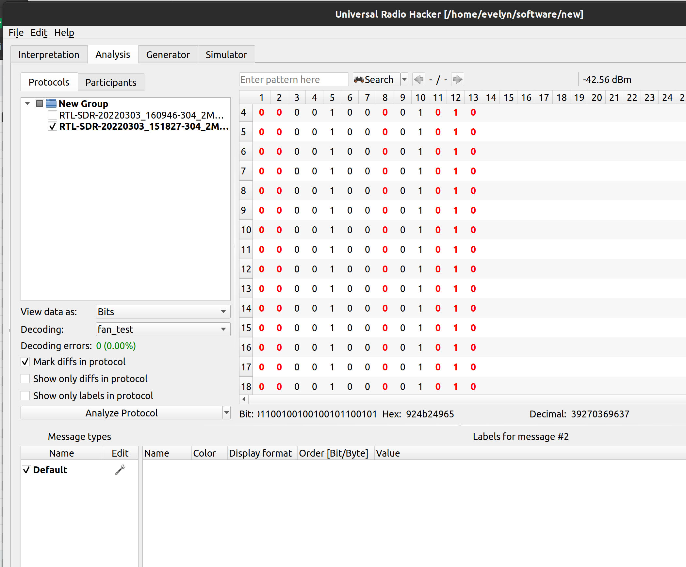

Based on 

# Intermittent Fan Controller

## Background

I can not sleep with a fan blowing on me.  My husband can not sleep without a fan on him.  Initially, I thought that
we could not sleep well together since ceiling fans are designed to be either on or off. 
Which is unfortunate since I like sleeping with him, and we could both sleep well if the
ceiling fan was only briefly on. I needed a way to turn the fan off after 5 minutes 
and then back on in 20 minutes. 
So I built an adjustable intermittent fan controller with roughly $30 of electronics and
two python scripts. 

The advantage of an intermittent fan is that it helps prevent the room from getting 
stuffy, while not having to worry about the user getting too cold because of the 
constant flow of air on them.

This project uses a raspberry Pi Zero, a low pass filter, and about 20cm of wire to control
a ceiling fan.  In addition, a custom flask app is running to allow a user to set 
how long the fan stays on and how long the fan is off for. 

|                Flask App                 | Raspi Fan Controller with Cat | 
|:----------------------------------------:| :---: |
|  | |

**WARNING** It might blow your mind to realize that turning a GPIO pin high and 
low really fast creates radio frequencies that can turn on your fan.  Also, **IT IS 
ILLEGAL** to transmit at many frequencies.  
You must use a low pass filter (433MHz Low Pass Filter will keep you legal).

## Setup
A python Flask app being served on the raspberry pi zero will be used to configure
how long the fan stays on/off and to set the fan's speed.  
Flask is a python web framework that enables you to easily develop web application with minimal setup.  
To serve a flask application it is as simple as `python app.py`. 
In this web application, when a button is pressed, an async command is 
ran on the raspberry pi.  This command sends a OOK (On OFF Key) signal at the fan's receiving 
frequency via [rpiTX](https://github.com/F5OEO/rpitx), which turns on/off a GPIO pin 7.  
The process of turning on/off the GPIO pin is what generates the RF signal.  The 20 cm 
of wire acts as an antenna so the signal can reach the fan's receiver.


### Figuring out the RF commands

First we need to know at what radio frequency (RF) the remote transmits at, then 
we need to figure how that signal is encoded.  The two main ways to figure
out what radio frequency a remote uses is to either measure it or read the manual.  
In order to measure it, one can use USB TV Tuner as shown in the
[Hack My Ceiling Fan Radio Signal with a $15 USB TV Tuner](https://www.youtube.com/watch?v=_GCpqory3kc&list=PLd0h4lJ7ve9KpkbUbsEXxsDlqNxwA-aWH&index=1). 
Or you can look up what frequency they are using at the FCC website.  
All transmitters have to report what frequency they use. 
Mine uses 304MHz [FCC ID: KUJCE10007](https://fccid.io/KUJCE10007).  


I measured 304.2MHz which is close enough.  
There is variation from remote to remote. I have three Minka Aire remotes and
some are higher or lower than stated.
To figure out how the RF signal is encoded you can measure it or 
use the information from the video ([River's Educational Video](https://www.youtube.com/watch?v=3lGU7PjJM7k)) .  Let's use the latter.

### Fans Codes

| Action       | Code  | 
|:-------      | :-----|
| Light: On    | 01010 | 
| Light: Off   | 10010 |
| Fan: Low     | 00100 |
| Fan: Med     | 01000 |
| Fan: High    | 10000 |
| Fan: OFF     | 10100 |
| Fan: Reverse | 00010 |

### Fan Unix ID Key
The Minka Aire has two sets of 4 toggle switches (e.g. 8 digits) that is used to set its unique ID.eight
Where:
Up  == 1
Down == 0

## Parts

* [433 Low Pass Filter](https://www.ebay.com/sch/i.html?_from=R40&_trksid=p2334524.m570.l1313&_nkw=433MHz+low+pass+filter&_sacat=0&LH_TitleDesc=0&_sop=15&_osacat=0&_odkw=400+MHz+low+pass+filter&LH_BIN=1&mkcid=1&mkrid=711-53200-19255-0&siteid=0&campid=5338762671&customid=minkaaire2&toolid=20012&mkevt=1)
 ~ $ 5.50
* ~20 cm of wire
* Raspberry Pi Zero ~ $25
* SD Card: $10

Nice to have:
* [USB TV Tuner](https://www.amazon.com/MyGica-Antenna-Laptop-Windows-Android/dp/B08Z383Y11/ref=sr_1_4?gclid=CjwKCAjw6MKXBhA5EiwANWLODOecn20Ud-zR47MALg8STVqo0nmHOg058T46ysVqpkDLkJTay6GUPhoCTqIQAvD_BwE&hvadid=174226871964&hvdev=c&hvlocphy=9015834&hvnetw=g&hvqmt=e&hvrand=12844467220829786195&hvtargid=kwd-4034224185&hydadcr=19108_9441150&keywords=usb+tv+tuner+stick&qid=1659979571&sr=8-4) ~ $30.00

## Putting it together

### Software Configurations
* Download this repo onto your raspberry pi
* Download [rpiTX](https://github.com/F5OEO/rpitx) and place it in the `./src` folder.
* You will need to configure the raspberry pi activate it's GPIO pins.
* Connect your raspberry pi to your Wi-Fi network.
  * Finds the IP address it is on: `hostname -I`
* python3 pip install flask, RPi.GPIO
* Set the Fan ID in the FanRemote class located in fan_controller.py
  * This is two sets of 4 bits.

### Hardware Configuration

Solder ~20 cm of wire to one end of 433MHz low pass filter.  
Solder two jumper cables to the other end: one the signal line 
and the other one to ground.
Connect the signal line to GPIO pin 7 and the ground to Raspberry Pi's ground.

### Run the Flask App

The flask app has three main parts: app.py, index.html and fan.css.
The app.py file is the python script serves the Flask app and 
responds when a user presses a button on the web application.  
index.html and fan.css are the web application.  

To run the app, go to the `./src` folder and type 

```bash
python3 app/app.py
```

This will initialize a flask app at the raspberry pi's ip address on port 5000.
Mine was at `http://192.168.2.80:5000`

The Flask app imports a fan class into to application.  When a button is pressed in the app, 
the `main` method in the flask app figures out how to respond and sends an async command to the fan.

## Warnings

**WARNING** 

**IT IS ILLEGAL** to transmit at many frequencies.  
You must use a low pass filter (433MHz Low Pass Filter will keep you legal).

## Bonus Material
### Measuring the RF Command

Using the USB TV remote, I was able to capture the raw RF signal using Universal Radio Hacker
(UHR) software. The fan uses OOK where 1 = 101 and 0 = 100.  The fan is expecting a signal at 304MHz where 
the first 8 digits is the fan's ID and the next 5 are the fan remote command.  
By recording for each button on the fan and then analysing each 
RF signal you can get the above table of commands.  

Do note that a different controller may use different frequencies and encodings. So, you may need to go 
through this process if you have a different controller.

| RF Interpretation                                           | RF Analysis |
|:------------------------------------------------------------|:---|
|  | | 

## References

Do watch River's Educational Channel for how to set up your Raspberry Pi and for the reason why we need a low pass filter.

* [Hack My Ceiling Fan Radio Signal with a $15 USB TV Tuner](https://www.youtube.com/watch?v=_GCpqory3kc&list=PLd0h4lJ7ve9KpkbUbsEXxsDlqNxwA-aWH&index=1) by River's Educational Channel.

* [Abusing Raspberry Pi GPIO pins as a radio transmitter to control my ceiling fan](https://www.youtube.com/watch?v=3lGU7PjJM7k)
	

* [ESP32_IR Remote for their wonderful css](https://github.com/e-tinkers/esp32_ir_remote)

* [FCCID KUJCE10007](https://fccid.io/KUJCE10007)

Additional Libraries

* [rpiTX](https://github.com/F5OEO/rpitx) 
